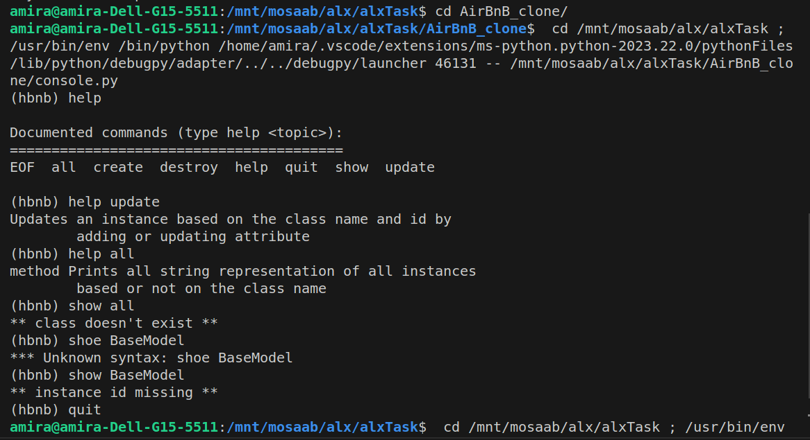
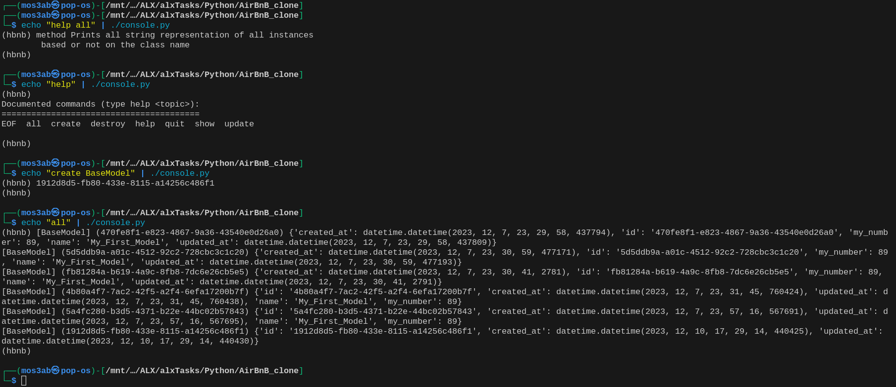

# AirBnB Clone Project

The AirBnB_clone project is a part of the curriculum of the software engineering program at Holberton School. It's a long-term project that covers the fundamental concepts of higher-level programming.

The project aims to build a simple clone of the AirBnB website, the first step being the creation of a console or command interpreter. This console would be used to manage the objects of the website and perform operations like creating new objects, retrieving an object from a file or a database, doing operations on them, updating attributes of an object, destroying an object, and more.

The objects are represented using classes. These classes include but are not limited to BaseModel, User, State, City, Amenity, Place, and Review. All the classes inherit from the BaseModel.

The console is command-line based and it takes specific commands to perform operations. For example, commands like create, show, destroy, update, all, etc.

The project also includes a simple file storage system, using the FileStorage class, which serializes instances to a JSON file and deserializes JSON files to instances.

The project is written in Python and is interpreted/tested on Ubuntu 14.04 LTS using Python3

## Description of the Command Interpreter

The command interpreter, or console, is designed to manage the objects of our AirBnB clone project. It can perform operations like creating new objects, retrieving an object from a file or a database, doing operations on them, updating attributes of an object, destroying an object, and more.

### How to Start

To start the console, navigate to the project directory and enter the following command:
bash ./console.py

### How to Use

Once the console is running, you can use the following commands:

- `create <class>`: Creates a new instance of `<class>`, saves it to the JSON file, and prints the `id`.
- `show <class> <id>`: Prints the string representation of an instance based on the class name and `id`.
- `destroy <class> < id >`: Deletes an instance based on the class name and `id`.
- `all <class>`: Prints all string representation of all instances based or not on the class name.
- `update <class> <id> <attribute name> "<attribute value>"`: Updates an instance based on the class name and `id` by adding or updating attribute.

## Example:

### Interactive-mode

### Non-Interactive-mode

